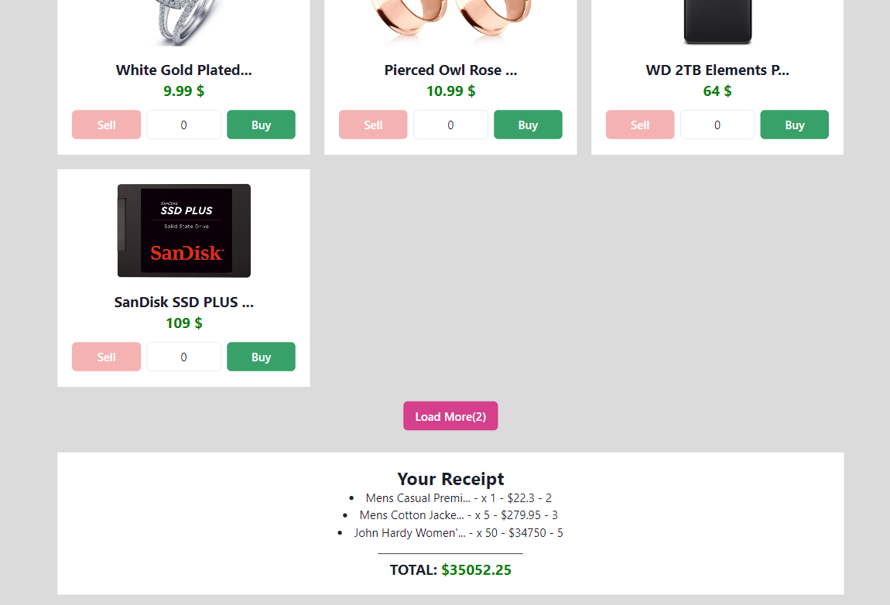

# React Redux Spend Bill Gates' Money App

This project assignment is prepared for the 'Kodluyoruz' React Redux course. The app is based on spending Bill Gates' $100,000,000,000 on imaginary products.

**DEMO**: https://sk-react-redux-spend-bill-gates-money.netlify.app/

---

---

